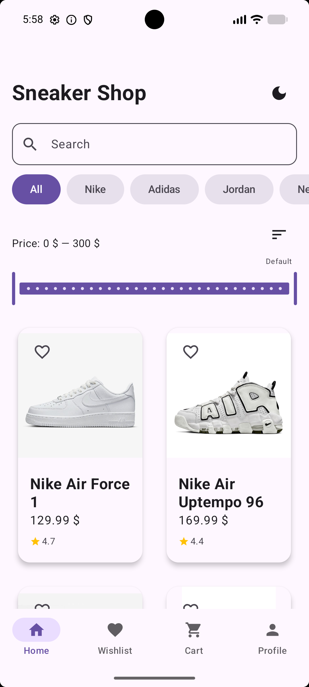
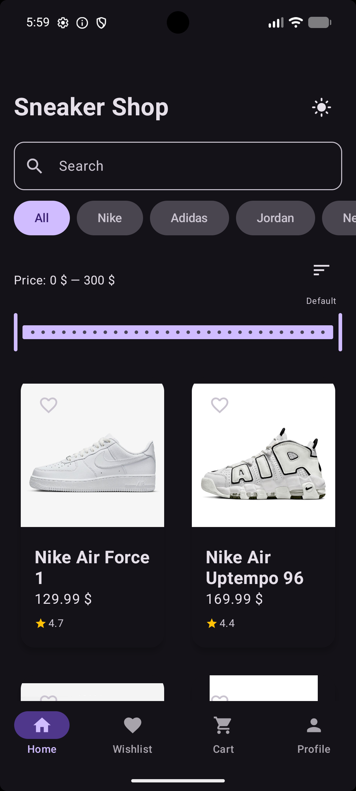
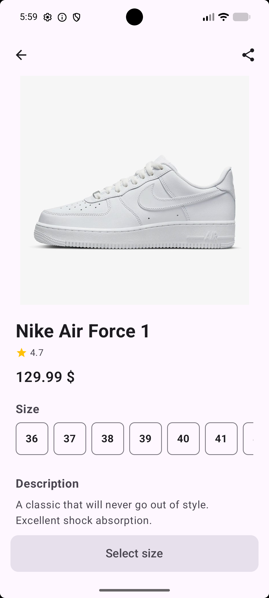
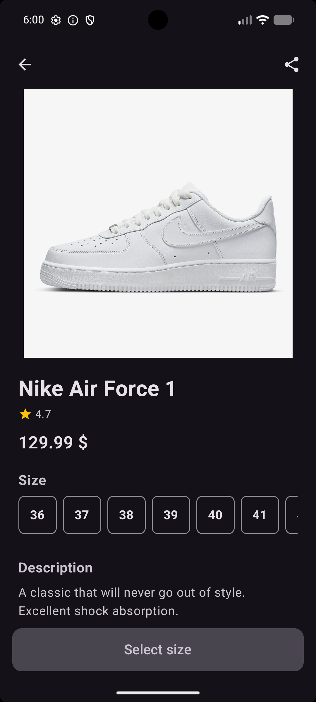
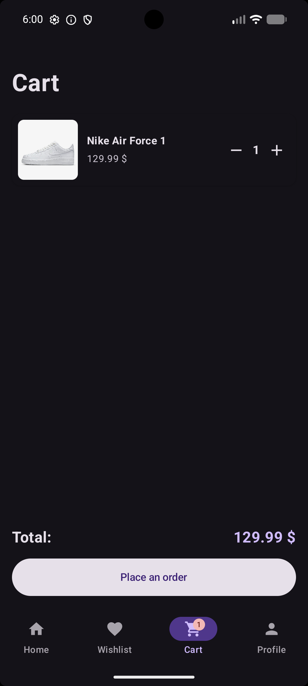
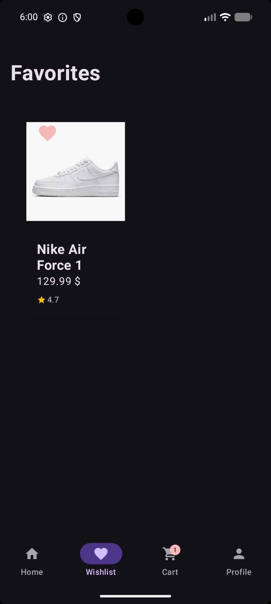
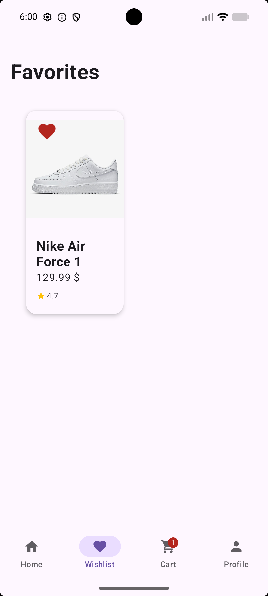
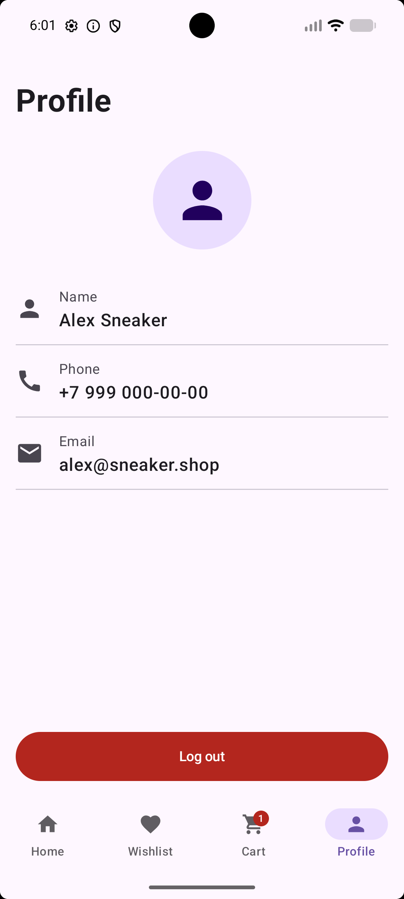
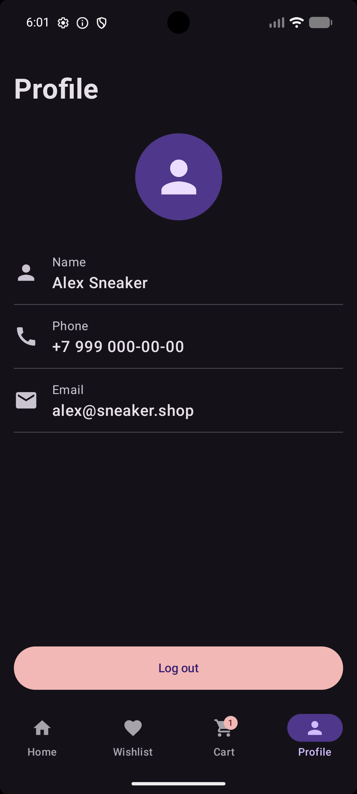
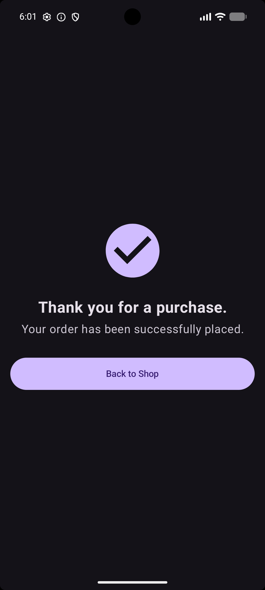

# SneakerShop 👟

An Android e-commerce app for browsing and purchasing sneakers from top brands, built with Jetpack Compose.

## Screenshots

| Home (Light) | Home (Dark) | Product Details |
|---|---|---|
|  |  |  |

| Details (Dark) | Cart | Wishlist |
|---|---|---|
|  |  |  |

| Wishlist (Dark) | Profile | Profile (Dark) | Checkout |
|---|---|---|---|
|  |  |  |  |

## Features

- Browse **15 sneakers** from Nike, Adidas, Jordan, New Balance and Puma
- **Search** by name in real time
- **Filter** by brand category
- **Filter by price** range with slider
- **Sort** by price (low to high / high to low)
- **Recently viewed** — last 5 sneakers shown on home screen
- Product details with **size selector** (EU 36–50)
- **Add to cart** with quantity controls (+ / -)
- **Cart badge** showing item count on bottom navigation
- **Wishlist** with heart animation
- **Share** sneaker via system share sheet
- **Star ratings** on product cards and details screen
- **Dark theme** with persistent toggle
- **Onboarding** on first launch (3 slides)
- **Smooth animations** — screen transitions, card press, heart bounce
- **Checkout** confirmation screen

## Tech Stack

- **Language:** Kotlin
- **UI:** Jetpack Compose + Material Design 3
- **Architecture:** MVVM (ViewModel + StateFlow)
- **Database:** Room (local storage)
- **Navigation:** Jetpack Navigation Compose
- **Animations:** Compose Animation API + Accompanist

## Architecture

MVVM pattern with clean separation:
- **UI layer** — Composable screens, observe StateFlow from ViewModel
- **ViewModel layer** — holds UI state, handles filtering/sorting/search
- **Data layer** — Room database + in-memory managers (Cart, Wishlist, Recently Viewed)

## Getting Started

1. Clone the repository:
```bash
git clone https://github.com/artkorzh228/SneakerShop.git
```
2. Open in Android Studio Hedgehog or newer
3. Build and run on emulator or device (min SDK 24)

> No API keys required — all sneaker data and images are stored locally.

## Known Limitations

- Cart and Wishlist data is stored in-memory and resets on process death
- Planned improvement: persist data with Room + ViewModel refactor

## License

MIT
